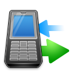

    <!-- content -->

  <!-- row1 -->
  

    

      

        

          <h1>Wat is Limesco?</h1>
        

        

          
Limesco is <strong>mobiele telefonie</strong>, je kan dus <strong>bellen, sms'en en internetten</strong> op je mobiel, maar dan met een aantal voordelen.

		  
Limesco is <strong>open, eerlijk en innovatief</strong>. We bestaan sinds 2012 en stukje bij beetje proberen we de telecomwereld te verbeteren.

		  
Lees meer <a href="over/wie-zijn-wij.html">over ons</a>, over onze <a href="over/idealen.html">idealen</a>, ontvang in de toekomst een <a href="https://inschrijven.limesco.nl/herinnering.php">herinnering</a>, of <a href="https://inschrijven.limesco.nl/"><em>sluit je nu aan</em></a>!

      

    

    

    

      

        

          <h1>Overtuigd van Limesco?</h1>
        

        

          

          Ben je <strong>overtuigd</strong> van de tofheid van Limesco? Klik dan op onderstaande
          knop om je aan te sluiten bij Limesco!
          

          

            
<a class="btn btn-success btn-lg" role="button" href="https://inschrijven.limesco.nl/"
                target="_blank">Ik sluit me aan!</a>

          

          

          Wil je later aan Limesco <strong>herinnerd</strong> worden, bijvoorbeeld omdat je
          huidige contract nog loopt?

		  

          
<a class="btn btn-success btn-lg" role="button" href="https://inschrijven.limesco.nl/herinnering.php"
                target="_blank">Herinner me!</a>

          

		  
          

          

            
            
            
            
          

          

        

      

    

    

  
  <!-- row2 -->
  

    

      

        

          <h1>Bundelloos</h1>
        

        

		

          

            
            <!-- icon by http://www.rockettheme.com CC-BY-ND -->
          

		  

          

		  

          Bij ons <em>geen</em> bundels! Je betaalt voor wat je verbruikt.
          Bundels laten je vaak teveel betalen; zowel binnen als buiten je
          bundel. Limesco geeft je inzage in je &eacute;chte verbruik.
          

		  <ul style="margin-left:-20px">
		  <li><strong>Verbruik je weinig?</strong> Dan betaal je weinig. Nooit meer verspilde bundels.</li>
		  <li><strong>Verbruik je meer?</strong> Dan betaal je meer. Nooit meer absurde buitenbundeltarieven.</li>
		  <li><strong>Zit je in het buitenland?</strong> Je betaalt gewoon voor je verbruik, je gooit niks weg.</li>
		  <li><strong>Bel je veel 0900-nummers?</strong> Je betaalt gewoon voor je verbruik, je gooit niks weg.</li>
		  </ul>
		  

        

      

    

    

      

        

          <h1>Open en eerlijk</h1>
        

        

		

          

            
			<!-- icon by http://www.doublejdesign.co.uk/ CC-BY -->
          

		  

		  

          

          De telecomwereld is een besloten geheel. Wij laten zien dat het
          anders kan. Wij hebben openbare software, alleen kundige mensen
          op de helpdesk en we zijn helder over wat we aanbieden.
          

		  <ul style="margin-left:-20px">
		  <li><strong>Je nummer naar ons overzetten</strong>, nu of later? Altijd gratis.</li>
		  <li><strong>Je telefoon kwijt of gestolen?</strong> Nieuwe SIM altijd gratis en snel binnen.</li>
		  <li><strong>Makkelijke of juist technisch complexe vragen?</strong> We helpen altijd gratis.</li>
		  </ul>
		  

        

      

    

  

  <!-- /row2 -->

  <!-- row3 -->
  

    

      

		

          <h1>Technisch innovatief</h1>
        

        

		  

          

            

          

		  

            

            <!-- icon by Youdu, CC-BY -->
          

		  

		  

          

		  Naast open, eerlijk en bundelloos streeft Limesco ook continue technische innovatie na. Wil je hier niks mee te maken hebben? Dan zal je er geen last van hebben. Ben je een techneut en wil je meer? Lees dan vooral verder.

		  <ul style="margin-left:-20px">
		  <li><strong>Betalen met bitcoin?</strong> Naast automatische incasso en iDeal, kan je zonder extra kosten je facturen in bitcoin voldoen.</li>
		  <li><strong>Zelf met een PBX je belverkeer afhandelen?</strong> Dat kan! Limesco is de enige partij die dit voor particulieren aanbiedt. Kijk onder <a
          href="/dienst/do-it-yourself.html">Do-It-Yourself</a>.</li>
		  <li><strong>Meeknutselen aan de vooruitgang en/of software?</strong> Onze <a
          href="https://secure.limesco.nl/wiki/" target="_blank">knowledgebase</a> en <a href="https://github.com/Limesco" target="_blank">software</a> zijn openbaar, help vooral mee!</li>
		  <li><strong>Al je gegevens beschikbaar per API?</strong> We werken er nu aan en verwachten deze feature binnenkort live aan te bieden!</li>
		  </ul>
		  

		  
          
        

      

    

  

<!-- /content -->
