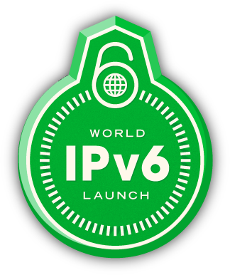

<!-- jumbotron -->

  

    

      
      <h1>Limesco</h1>
      <h3>Open, Eerlijk, Innovatief</h3>
    

    

      <h1>Limesco</h1>
      <h3>Open, Eerlijk, Innovatief</h3>
    

    
<a class="btn btn-success btn-lg" role="button">Sluit je nu aan!</a>

  

<!-- /jumbotron -->

<!-- content -->

  <!-- row1 -->
  

    

      

        

          Bundelloos
        

        

          

            
            <!-- icon by http://www.rockettheme.com CC-BY-ND -->
          

          

          Bij ons <em>geen</em> bundels! Je betaalt voor wat je verbruikt.
          Bundels laten je vaak teveel betalen; zowel binnen als buiten je
          bundel. Limesco geeft je inzage in je &eacute;chte verbruik.
          

        

      

    

    

      

        

          Overtuigd van Limesco?
        

        

          

          Ben je <strong>overtuigd</strong> van de tofheid van Limesco? Klik dan op onderstaande
          knop om je aan te sluiten bij Limesco!
          

          

            
<a class="btn btn-success btn-lg" role="button">Sluit je nu aan!</a>

          

          

          Wil je later aan Limesco <strong>herinnerd</strong> worden, bijvoorbeeld omdat je
          huidige contract nog loopt? <a href="https://inschrijven.limesco.nl/herinnering.php">Klik dan hier!</a>
          

          

            
            
            
            
          

          

        

      

    

    

      

        

          Bitcoin
        

        

          

            
          

          

          Als een van de eerste telecomoperators in de Benelux accepteren
          wij Bitcoin als betaalmiddel! Uiteraard kan je ook gewooon betalen
          via <em>automatisch incasso</em> en <em>iDeal</em>.
          

        

      

    

  

  <!-- /row1 -->

  <!-- row2 -->
  

    

      

        

          Open en eerlijk
        

        

          

            
            <!-- icon by http://www.doublejdesign.co.uk/ CC-BY -->
          

          

          De telecomwereld is een besloten geheel. Wij laten zien dat het
          anders kan. Wij hebben openbare software, alleen kundige mensen
          op de helpdesk en we zijn helder over wat we aanbieden.
          

        

      

    

    

      

        

          PBX
        

        

          

            
            <!-- icon by Youdu, CC-BY -->
          

          

          Zelf je belverkeer afhandelen? Geen probleem! Met
          <em>Do-It-Yourself</em> leg je de controle over je belgedrag bij
          jezelf! Met je eigen telefooncentrale krijg je volledige
          flexibiliteit over je 06-nummer.
          

        

      

    

  

  <!-- /row2 -->

  <!-- row3 -->
  

    

      

        

          Actieve community
        

        

          

            
          

          

          Een telefonieprovider is niks zonder gebruikers. Zij dragen bij
          aan Limesco via onze <em>knowledgebase</em> in de vorm van een <a
          href="https://secure.limesco.nl/wiki/">wiki</a>, onze <a
          href="https://github.com/Limesco">software</a> en nog veel meer.
          Doe je mee?
          

        

      

    

    

      

        

          API en IPv6
        

        

          

            
          

          

          Limesco wil vooruitstrevend zijn. Binnenkort kan je zelf al je
          gegevens opvragen en op jouw manier verwerken via onze API. IPv6
          is de toekomst, helaas nog niet bij mobiel internet. Daar gaan
          wij verandering in brengen!
          

        

      

    

  

  <!-- /row3 -->

<!-- /content -->
