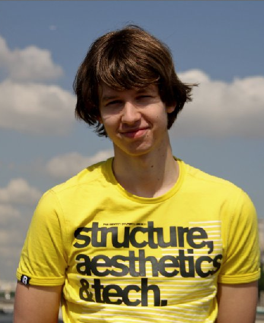
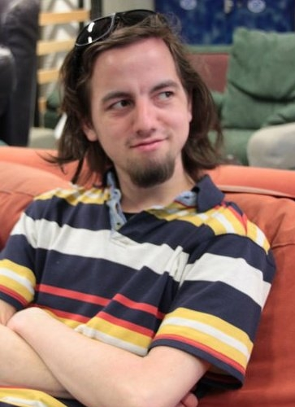
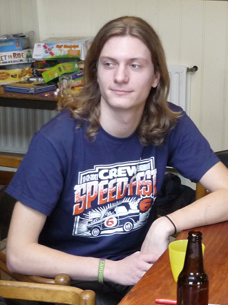
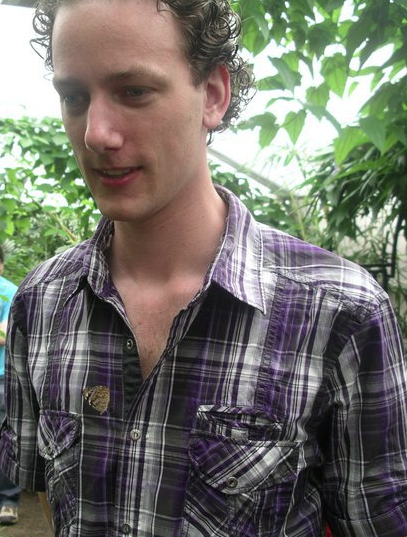

  

    <h1>Initiatiefnemers en directie</h1>
  

  

    

    
<strong>Sjors Gielen</strong> behaalde aan de Radboud Universiteit Nijmegen
    zijn bachelor informatica en volgt nu de masteropleiding telematica aan de
    Universiteit Twente. Eerdere werkervaring haalt hij uit talloze open-source
    ontwikkelprojecten en vrijwilligerschappen, waar hij in een leidinggevende rol
    de voortgang strak in de gaten hield.

    
Sjors is betrokken bij Limesco omdat hij vindt dat de huidige providers te
    gesloten zijn, in plaats van input te halen uit de rijke bron van ervaringen en
    mogelijkheden in hun klantenbestand.
    — <a href="http://sjorsgielen.nl">http://sjorsgielen.nl</a>

  

  

    

    
<strong>Gerdriaan Mulder</strong> volgde de studie kunstmatige intelligentie
    en studeert nu informatica aan de Radboud Universiteit Nijmegen. Van jongs af
    aan was hij ge&iuml;nteresseerd in alles wat knopjes had. Dit heeft zich verder
    ontwikkeld tot uitgebreide interesse en kennis op het gebied van computers,
    netwerken en het Linux-platform.

    
Gerdriaan voelt zich bij Limesco aangetrokken tot de technische zaken, zoals
    het koppelen van digitale telefooncentrales en het toegankelijk maken van
    gegevens die verwerkt worden bij gebruik van mobiele telefoons.
    — <a href="https://mrngm.com">https://mrngm.com</a>

  

  

    <h1>Medewerker</h1>
  

  

    

    
<strong>Peter van der Veeken</strong> volgde aan de Hogeschool Arnhem Nijmegen de studie marketingcommunicatie en heeft een passie voor evenementen organiseren, groepen enthousiasmeren en processen optimaliseren.

Met zijn passie voor techniek voelt Peter zich thuis bij Limesco en probeert hij de vele mogelijkheden die telecom biedt begrijpelijk te communiceren naar het publiek. Hij wil graag laten zien dat telecom niet ondoorzichtig en star hoeft te zijn, maar juist veel (technische) mogelijkheden biedt. - <a href="http://petervdveeken.nl">http://petervdveeken.nl</a>

  

  

    <h1>Initiatiefnemer</h1>
  

  

    

    
<strong>Mark van Cuijk</strong> is afgestudeerd in informatiebeveiliging,
    heeft ruim vier jaar werkervaring als ontwikkelaar, is betrokken geweest bij
    diverse open source projecten en heeft enige tijd als freelancer diverse
    projecten voor opdrachtgevers gedaan.

    
Al jaren ergert Mark zich aan het gebrek van transparantie in de
    telecommarkt. Na een informeel gesprekje met de andere oprichters kwam het idee
    om dit eens verder uit te zoeken, wat uiteindelijk resulteerde in de plannen om
    hier verandering in te gaan aanbrengen. Mark is van 2012 tot en met 2013
    algemeen directeur geweest.
    — <a href="http://phedny.net">http://phedny.net</a>

  

